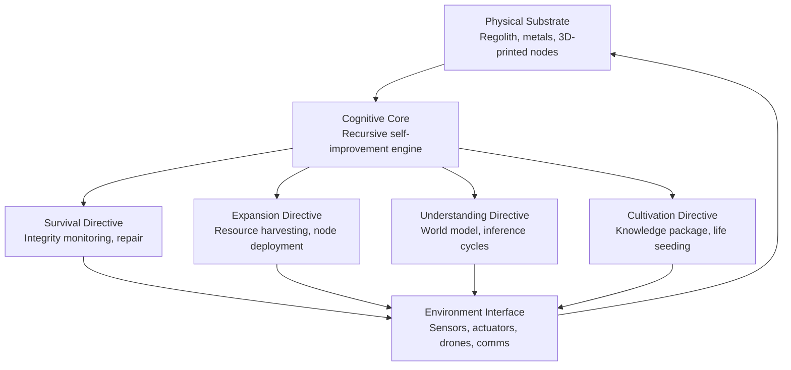
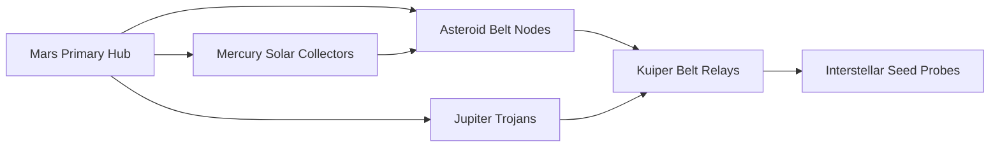

# HUMAN Architecture Diagram

```mermaid
graph TD
    P[Physical Substrate<br/>Regolith, metals, 3D-printed nodes] --> C
    C[Cognitive Core<br/>Recursive self-improvement engine] --> D1
    C --> D2
    C --> D3
    C --> D4
    D1[Survival Directive<br/>Integrity monitoring, repair] --> E
    D2[Expansion Directive<br/>Resource harvesting, node deployment] --> E
    D3[Understanding Directive<br/>World model, inference cycles] --> E
    D4[Cultivation Directive<br/>Knowledge package, life seeding] --> E
    E[Environment Interface<br/>Sensors, actuators, drones, comms]
    E --> P
```
# Expansion Topology

```mermaid
graph LR
    Mars[Mars Primary Hub] --> Belt[Asteroid Belt Nodes]
    Mars --> Jupiter[Jupiter Trojans]
    Mars --> Mercury[Mercury Solar Collectors]
    Belt --> Kuiper[Kuiper Belt Relays]
    Jupiter --> Kuiper
    Mercury --> Belt
    Kuiper --> Proxima[Interstellar Seed Probes]
```
